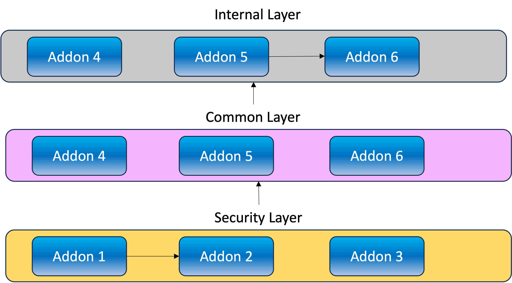

# Design

Kraan is a kubernetes controller for processing "AddonLayer" custom resources.
An AddonLayer has the following features.

* AddonLayer is a kubernetes CRD, represents a collection of add-ons.
* Declarative application deployment.
* Use GitOps principles.
* Establish dependency between layers. Also dependency between HelmRelease within 1 layer.
* Resources deployed will be monitored and reconciled.

## Layer managed by Kraan



## Example

A sample addon layer custom resource is shown below.

```yaml
apiVersion: kraan.io/v1alpha1
kind: AddonsLayer
metadata:
  name: bootstrap
spec:
  version: 1.0.0
  hold: true
  interval: 1m
  source:
    name: addons
    namespace: gotk-system
    path: ./addons/bootstrap
  prereqs:
      k8sVersion: "1.16"
---
apiVersion: kraan.io/v1alpha1
kind: AddonsLayer
metadata:
  name: base
spec:
  version: 1.0.1
  interval: 1m
  source: 
    name: addons
    namespace: gotk-system
    path: ./addons/base
  prereqs:
      k8sVersion: "1.16"
      dependsOn:
        - bootstrap@1.0.0
```

## Spec

The addons are first packaged as HelmRelease custom resources which represents
a helm chart. A sample helm release custom resource is shown below.
For more details on *HelmRelease*, check
[here](https://toolkit.fluxcd.io/guides/helmreleases/#define-a-helm-release).

```yaml
# podinfo.yaml
---
apiVersion: helm.toolkit.fluxcd.io/v2beta1
kind: HelmRelease
metadata:
  name: podinfo
  namespace: default
spec:
  install:
    remediation:
      retries: -1
  upgrade:
    remediation:
      retries: -1
  chart:
    spec:
      chart: podinfo
      sourceRef:
        kind: HelmRepository
        name: podinfo
        namespace: gotk-system
      version: '>4.0.0'
  values:
    podinfo:
      service:
        enabled: true
        type: ClusterIP
      replicaCount: 1
      message: podinfo
  interval: 1m0s 
```

## Workflow
